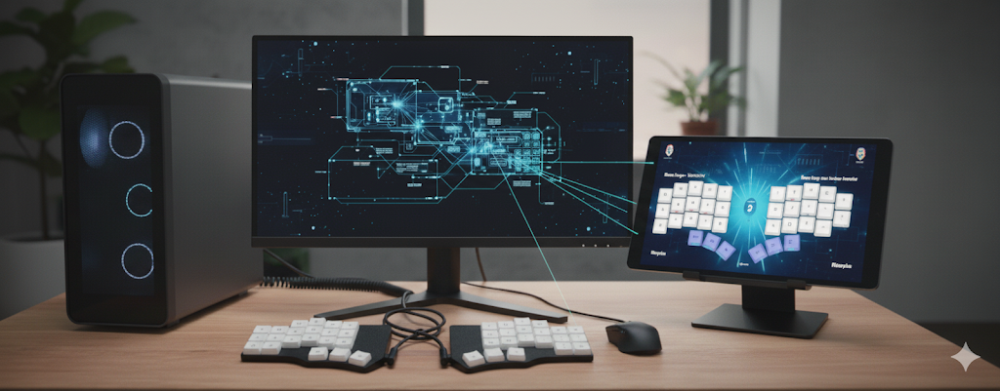

# Keyboard Layers App companion

Display the selected keyboard layer layout on screen to assist your to memorize the key's locations.

It supports displaying the layout in a remote screen, so you can use a tablet or similar to save space on your main screen.

It requires some changes to your keyboard firmware to notify the host of the layer changes (see below).

The example layouts are based on [Miryoku QMK](https://github.com/manna-harbour/miryoku_qmk) and you can easily define your own.

Demonstration video:

[](https://www.youtube.com/watch?v=WpxBLXetmFg)

## Display on a remote host

Start the program with the `--remote` option on the host and with `--client` on your tablet - the host will discover the client automatically.

Optionally, the client IP can be specified.




## QMK Firmware changes

The application works by receiving data sent to the computer by the keyboard when it switchs between layers, using raw HID.

It requires the following to be added to your QMK firmware [(reference)](https://github.com/maatthc/qmk_userspace/tree/main/keyboards/beekeeb/piantor/keymaps/manna_harbour_miryoku):

**File**: keyboards/<your_keyboard>/keymaps/<default|yours>/keymap.c

``` c
#include QMK_KEYBOARD_H
#include "print.h"
#include "raw_hid.h"

...

// Notifies the host of the layer change
layer_state_t layer_state_set_user(layer_state_t state) {
    uint8_t hi_layer = get_highest_layer(state);
#ifdef CONSOLE_ENABLE
    uprintf("LAYER: Selected Layer: %d\n", hi_layer);
#endif
    raw_hid_send(&hi_layer,32);
    return state;
}
```

Layers reference for Miryoku: [miryoku_layer_list.h](https://github.com/manna-harbour/miryoku_qmk/blob/miryoku/users/manna-harbour_miryoku/miryoku_babel/miryoku_layer_list.h)

**File**: keyboards/<your_keyboard>/keymaps/<default|yours>/config.h

``` c
#define RAW_USAGE_PAGE 0xFF60
#define RAW_USAGE 0x61
```

## Configuration

The Configuration is done via the `config.ini` file.

-   Keyboard's USB details: refer to the [QMK HDI documentation](https://docs.qmk.fm/features/rawhid) for details on how to find the correct values for your keyboard. 

>> "you will need to know the USB Vendor and Product IDs of the device. These can easily be found by looking at your keyboard's info.json, under the usb object (alternatively, you can also use Device Manager on Windows, System Information on macOS, or lsusb on Linux)."

-   Layer image files: the example files are for Miryoku QMK, but you can define your own (see below). Layers that are not used can be left empty.

Example `config.ini`:

``` ini

[KEYBOARD_USB_HID]
vendor_id = 0xBEEB
product_id = 0x0001
usage_page = 0xFF60
usage = 0x61

[LAYER_IMAGES]
layer_0 = miryoku-kle-base.png 
layer_1 = 
layer_2 =
layer_3 =
layer_4 = miryoku-kle-nav.png 
layer_5 = miryoku-kle-mouse.png 
layer_6 = miryoku-kle-media.png 
layer_7 = miryoku-kle-num.png 
layer_8 = miryoku-kle-sym.png 
layer_9 = miryoku-kle-fun.png 
```

## Define your own layouts

Build your own layouts using [KLE](http://www.keyboard-layout-editor.com) - you can find json examples on the [Miryoku QMK repo](https://github.com/manna-harbour/miryoku/tree/master/data/layers/) or use [mine](https://github.com/maatthc/miryoku_qmk/tree/miryoku/data/layers).

At KLE, use the "Upload JSON" button in the "Raw data" tab to upload the examples.

Once you are done editing, download the PNG files, copy it to the `assets` folder, rename it properly and update the config file.


## How to run

This application should work on all OSs compatible with HIDAPI.\
At the moment, only instructions for Fedora Linux are available.

### Linux

#### Install Dependencies

Fist install [HIDAPI](https://pypi.org/project/hid/) on your system. E.g. on Fedora:

`dnf install hidapi`

Then install the required Python packages:

`pip install kivy tenacity argparse hid zeroconf`

#### Run the main script

`python main.py`

##### Remote Display

The **--client-ip** is optional.

Host:

`python keyboard_layers.py --remote < --client-ip >`

Client:

``` python keyboard_layers.py --client < --client-ip > ```
